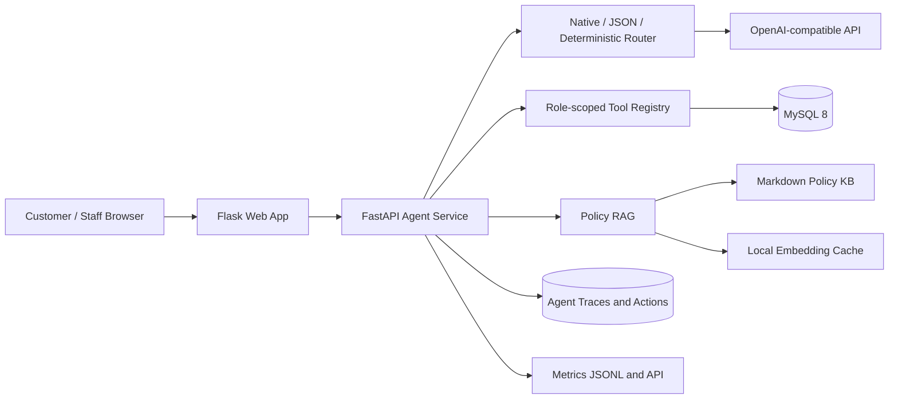

# Airline AgentOps Platform

[English](README.md) | [简体中文](README.zh-CN.md)

A production-like airline operations platform that combines a Flask booking application, a FastAPI Agent service, MySQL, grounded policy RAG, bounded multi-step execution, human confirmation, and AgentOps observability.

**Project status:** P0–P4 are complete and verified. The repository uses synthetic airline inventory and mock payment; it is intended for Agent engineering, governance, and full-stack demonstration rather than real airline commerce.

## Overview

The platform serves two authenticated experiences:

- Customers can search flights using IATA codes or English and Chinese city names, ask cited policy questions, store travel preferences, review trips, prepare bookings, and confirm cancellation previews.
- Airline staff can use a role-scoped copilot for sales, review, load-factor, and route analysis, then inspect traces, fallbacks, latency, and confirmation events in an AgentOps dashboard.

The model selects or sequences approved tools; local services enforce identity, authorization, validation, database access, and transaction boundaries. The model never receives direct SQL access and cannot complete a purchase or cancellation through ordinary chat.

## Capabilities

| Area | Implemented behavior |
| --- | --- |
| Natural-language search | Resolves IATA codes and supported English or Chinese city names, relative dates, months, years, airline preferences, and budgets against database inventory. |
| Customer Agent | Searches bookable flights, answers grounded policy questions with citations, retrieves active trips, and remembers route, airline, and budget preferences. |
| Booking handoff | A purchase request stops at a selected flight and opens the Search Flights checkout; chat never issues a ticket. |
| Cancellation workflow | The Agent calculates a fee/refund preview and creates a confirmation-gated action before cancellation can execute. |
| Staff Copilot | Runs airline-scoped sales, review, load-factor, and correlated route-performance analysis. |
| Bounded runtime | Supports `single_step`, `bounded_react`, and `auto` execution with step limits, role-scoped tools, observations, and explicit stop reasons. |
| Grounded RAG | Uses embedding retrieval and grounded LLM answers when configured, with keyword and extractive fallbacks when external services are unavailable. |
| Human-in-the-loop | Persists booking and cancellation actions, expiration, decisions, idempotent results, and audit events. |
| AgentOps | Exposes request metrics and a staff dashboard for traces, tools, runtime mode, latency, fallbacks, errors, and confirmation gates. |
| Governance | Uses signed service identities, CSRF protection, role and airline isolation, tool risk categories, UTC storage, and IANA timezone display. |

## Architecture



The Flask application owns browser sessions and user-facing workflows. It calls FastAPI with a short-lived signed service identity. FastAPI plans bounded work, validates tool access, executes local business operations, and records operational metadata.

## Technology

| Layer | Technology |
| --- | --- |
| Web application | Python 3.11, Flask, Jinja, HTML/CSS/JavaScript |
| Agent service | FastAPI, Pydantic, Uvicorn |
| Data access | MySQL 8, PyMySQL, parameterized SQL |
| AI and retrieval | OpenAI-compatible chat/tool API, embedding retrieval, Markdown policy knowledge base |
| Security | ItsDangerous signed identities, session-bound CSRF, role/tool guards |
| Testing and load | pytest, Locust, browser responsive smoke tests |
| Runtime | Docker Compose |

## Quick Start

### Requirements

- Git
- Docker Desktop or Docker Engine with Compose v2
- Optional: an OpenAI-compatible API key for native routing, embeddings, and grounded LLM answers

### 1. Clone and configure

```bash
git clone https://github.com/keith1117/airline-agentops-platform.git
cd airline-agentops-platform
cp .env.example .env
```

The default configuration runs without an external model. In `auto` mode, unavailable model capabilities fall back to deterministic routing, keyword retrieval, and extractive policy answers.

To enable the real model path, set these values in `.env`:

```env
LLM_API_KEY=your_api_key
LLM_BASE_URL=https://api.openai.com/v1
LLM_MODEL=gpt-4o-mini

EMBEDDING_API_KEY=your_api_key
EMBEDDING_BASE_URL=https://api.openai.com/v1
EMBEDDING_MODEL=text-embedding-3-small
```

### 2. Start the stack

```bash
docker compose up --build
```

Compose starts MySQL, seeds the demo inventory, and starts the Agent service, Flask web application, and phpMyAdmin. All exposed services bind to loopback.

### 3. Open the services

| Service | URL |
| --- | --- |
| Web application | <http://127.0.0.1:5050> |
| Agent health | <http://127.0.0.1:8001/health> |
| phpMyAdmin | <http://127.0.0.1:8080> |

Demo accounts:

| Role | Username | Password |
| --- | --- | --- |
| Customer | `testcustomer@nyu.edu` | `1234` |
| Airline staff | `admin` | `abcd` |
| phpMyAdmin | `root` | `root` |

Check service state and health:

```bash
docker compose ps
curl http://127.0.0.1:8001/health
```

Stop the stack without deleting the database volume:

```bash
docker compose down
```

## Configuration

Use `.env.example` as the source of truth for available settings.

| Group | Variables | Default behavior |
| --- | --- | --- |
| Database | `MYSQL_HOST`, `MYSQL_PORT`, `MYSQL_USER`, `MYSQL_PASSWORD`, `MYSQL_DB` | Docker uses the internal MySQL service; the host port is `3307`. |
| Agent routing | `AGENT_ROUTER_MODE`, `TOOL_ROUTER_MODE` | `auto` tries native tool calling, then JSON routing, then deterministic routing. |
| Runtime | `AGENT_RUNTIME_MODE`, `MAX_AGENT_STEPS` | `single_step` with a maximum of 4 steps when bounded execution is enabled. |
| Retrieval | `RAG_RETRIEVER_MODE`, `RAG_TOP_K`, `RAG_SIMILARITY_THRESHOLD` | `auto`, top 3 policy chunks, minimum similarity `0.35`. |
| Policy answers | `POLICY_ANSWER_MODE` | `auto` uses grounded LLM answers when available and extractive answers as fallback. |
| Model | `LLM_API_KEY`, `LLM_BASE_URL`, `LLM_MODEL` | OpenAI-compatible endpoint; no key is required for fallback operation. |
| Embeddings | `EMBEDDING_API_KEY`, `EMBEDDING_BASE_URL`, `EMBEDDING_MODEL`, `EMBEDDING_DIMENSIONS` | Inherits the LLM connection when embedding-specific values are empty. |
| Knowledge base | `RAG_POLICY_PATH`, `RAG_EMBEDDING_CACHE` | Markdown policy source and a local JSON embedding cache. |
| Observability | `AGENT_TRACE_ENABLED`, `METRICS_LOG_PATH` | Traces enabled; metrics written under `logs/`. |
| Time | `TZ`, `BUSINESS_TIMEZONE` | Services use UTC; business reporting defaults to UTC. |
| Service security | `SECRET_KEY` | An empty or development value creates a persistent local random secret shared by the Docker services. |

Supported mode values:

```text
AGENT_ROUTER_MODE=auto | deterministic | llm
TOOL_ROUTER_MODE=auto | native | json | deterministic
AGENT_RUNTIME_MODE=auto | single_step | bounded_react
RAG_RETRIEVER_MODE=auto | keyword | embedding
POLICY_ANSWER_MODE=auto | extractive | llm
```

## Demo Workflows

### Customer booking

1. Sign in as the demo customer and open **AI Agent**.
2. Ask: `Find the cheapest flight from San Francisco to Los Angeles next month and prepare a booking.`
3. Review the database-backed result and choose **Book**.
4. Confirm the exact flight on **Search Flights**, enter the checkout fields, and submit the mock purchase.
5. Review the issued ticket under **My Flights** and the completed action under **Pending Actions**.

Checkout accepts a 13–19 digit card number for validation. The number is not persisted; the ticket stores only the literal `MOCK-PAYMENT` token.

### Policy question

Ask: `Can I get a refund if my flight is cancelled?` The response includes citations selected by the backend from retrieved policy chunks.

### Cancellation confirmation

1. Ask the Customer Agent to cancel a ticket by ID.
2. Review the calculated fee and refund preview.
3. Open **Pending Actions** and explicitly confirm or reject the action.

The preview does not change ticket state. Confirmation revalidates the original preview and commits the cancellation and audit event atomically.

### Staff operations

1. Sign in as the demo staff account and open **AI Copilot**.
2. Ask: `Which route has strong sales but poor reviews?`
3. Review the correlated route and review observations.
4. Open **AgentOps** to inspect runtime mode, tool sequence, latency, fallback status, and bounded trajectory.
5. Use **Action Queue** to audit customer actions for the staff member's airline; staff cannot confirm a transaction for the customer.

## API and Security Boundaries

| Endpoint | Access | Purpose |
| --- | --- | --- |
| `GET /health` | Public local health check | Reports Agent, database, policy index, and clock status. |
| `POST /api/agent/customer/chat` | Signed customer identity | Customer Agent requests scoped to the authenticated customer. |
| `POST /api/agent/staff/chat` | Signed staff identity | Staff Copilot requests scoped to the authenticated airline. |
| `POST /api/agent/confirm-cancellation` | Signed customer identity | Executes a valid persistent cancellation action. |
| `GET /api/agentops/dashboard` | Signed staff or operator identity | Returns airline-scoped trace and AgentOps aggregates. |
| `GET /api/metrics` | Signed staff or operator identity | Returns in-memory request, latency, error, role, and tool metrics. |
| `POST /api/eval/run` | Signed operator identity | Runs an evaluation suite. |
| `POST /api/agent/confirm-booking` | Retired (`410 Gone`) | Direct API booking is disabled; checkout is required. |

Security and transaction rules:

- Browser POST requests use session-bound CSRF tokens and HTTP-only, SameSite cookies.
- FastAPI `/api/*` routes require a signed identity that expires after 120 seconds.
- Principals and airline scopes are checked independently of model output.
- Tools are classified as `safe_read`, `controlled_write`, or `human_confirmed`.
- The model cannot execute raw SQL or invoke `human_confirmed` tools through ordinary routing.
- Booking uses row locks, last-seat protection, fare validation, monotonic ticket allocation, and idempotent action results.
- Trace views redact customer request and response content from staff while retaining operational metadata.
- MySQL sessions, service clocks, traces, and audit timestamps use UTC; pages display airport-local and traveler-local IANA timezones.

## Testing and Verified Results

Create a local environment when running tests outside Docker:

```bash
python3.11 -m venv .venv
source .venv/bin/activate
pip install -r requirements.txt
```

Fast deterministic regression without MySQL acceptance tests:

```bash
TOOL_ROUTER_MODE=deterministic \
AGENT_ROUTER_MODE=deterministic \
RAG_RETRIEVER_MODE=keyword \
POLICY_ANSWER_MODE=extractive \
python -m pytest tests -q
```

Full regression against the running Docker MySQL service:

```bash
MYSQL_HOST=127.0.0.1 MYSQL_PORT=3307 \
RUN_P0_ACCEPTANCE=1 RUN_P1_MEMORY=1 RUN_P1_EVAL=1 \
RUN_P1_TRACE=1 RUN_P1_CORE=1 RUN_P4_ACTIONS=1 \
python -m pytest tests -q
```

Focused bounded-runtime tests:

```bash
python -m pytest tests/test_p3_bounded_react.py -q
```

Deterministic Agent QA:

```bash
python -m agent_service.run_agent_qa \
  --seed 42 \
  --count 24 \
  --tool-router-mode deterministic \
  --runtime-mode bounded_react \
  --rag-retriever-mode keyword \
  --policy-answer-mode extractive \
  --fail-on-failures
```

Authenticated 20-user Locust smoke from the Agent container:

```bash
docker compose exec -T agent python -m locust \
  -f load_tests/locustfile.py \
  --headless \
  --host http://127.0.0.1:8001 \
  --users 20 \
  --spawn-rate 5 \
  --run-time 1m \
  --only-summary
```

Latest verified results:

| Area | Result |
| --- | --- |
| Deterministic regression | `110 passed, 24 skipped` |
| Docker MySQL full regression | `134 passed` |
| P3 bounded runtime | `23 passed` |
| Basic Agent eval | `23/23 passed`; tool accuracy and citation presence `1.0` |
| Deterministic QA smoke | `10 passed, 0 failed` |
| Live model smoke | Native `search_flights` passed; 2 returned flights matched database rows; embedding retrieval, grounded LLM answer, and policy citations passed. |
| External API failure | Deterministic router, keyword retrieval, extractive answer, fallback reasons, and citations passed. |
| Responsive UI | Pending Actions, checkout, and AgentOps passed at `1440x900` and `390x844` without page-level horizontal overflow. |

Locust result:

| Scenario | Requests | Failures | Average | P95 |
| --- | ---: | ---: | ---: | ---: |
| Customer flight search | 563 | 0 | 26 ms | 45 ms |
| Customer policy QA | 563 | 0 | 12 ms | 19 ms |
| Staff review analytics | 563 | 0 | 21 ms | 33 ms |
| Staff sales report | 562 | 0 | 18 ms | 28 ms |
| Metrics polling | 562 | 0 | 1 ms | 2 ms |
| **Total** | **2813** | **0** | **16 ms** | **33 ms** |

Observed throughput was `47.17 requests/s`. This is a local smoke benchmark for regression and demonstration, not a production capacity claim or service-level objective.

## Repository Layout

```text
.
├── agent_service/       FastAPI Agent runtime, tools, RAG, actions, security, and metrics
├── templates/           Customer and staff Flask views
├── static/              Shared styles and browser timezone handling
├── tests/               Unit, regression, acceptance, security, and timezone tests
├── eval/                Deterministic Agent evaluation suites
├── load_tests/          Locust workload
├── scripts/             Seed, synthetic-data, QA, and load helpers
├── sql/                 Core schema, Agent migration, and demo data
├── docs/                Policy and implementation records
├── app.py               Flask application
└── docker-compose.yml   Local multi-service stack
```

Documentation:

- [Complete P0–P4 development log (Chinese)](docs/development-log-p0-p4.md)
- [Airline policy knowledge base](docs/policies/airline_policy.md)
- [P0 project progress record](docs/project_progress_report_p0.md)
- [P3/P4 bounded AgentOps implementation record](docs/P3-P4.md)

## Limitations

- Inventory, customers, tickets, and reviews are synthetic or locally seeded.
- Payment is mocked; no card number is stored and no payment processor is contacted.
- The project does not connect to airline distribution, reservation, or ticketing systems.
- The embedding index is a lightweight local JSON cache rather than a managed vector database.
- The repository includes evaluation and SFT-ready trace export, but no model fine-tuning, SFT training, or Agentic RL training has been performed.
- The included Docker configuration is a local demonstration stack, not a production deployment specification.
