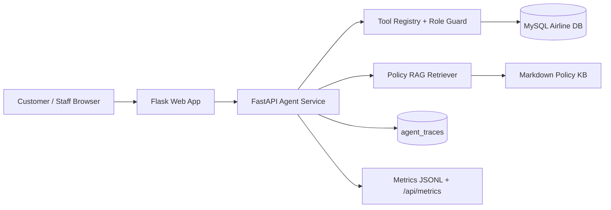

# Airline AgentOps Platform

Production-like AI Agent MVP built on top of a Flask/MySQL airline ticket reservation system.

This project demonstrates a stable **P0/P1/P2 Agent demo** for AI application engineering: ReAct-style tool routing, safe tool calling, RAG policy QA with citations, pending booking confirmation, role-based staff analytics, user memory, deterministic Agent Eval, SFT-ready trace export, Docker Compose, observability, and acceptance tests.

P1 is complete for the current portfolio scope. The customer agent can save route, budget, and airline preferences, then apply them to later searches when the user omits those details. The eval suite uses deterministic task checks for expected tools, answer keywords, citations, forbidden tools, and selected tool arguments. Trace export produces SFT-ready JSONL trajectories without claiming that real SFT has been performed.

P0.5 adds a Figma-inspired visual refresh for portfolio presentation: travel hero, refined navigation, dashboard cards, readable tables, and polished Agent/Copilot chat panels. It is presentation-only and does not change Agent behavior.

P2 adds lightweight observability: the Agent service records request counts, latency, role labels, tool-call counts, and error counts in memory and JSONL logs. It exposes a read-only metrics endpoint for demos and Locust benchmark reporting.

P2 also includes a Locust smoke-test profile for small-scale load testing. The goal is not high-scale benchmarking yet; it is a repeatable 20-user smoke that exercises customer search, policy QA, staff review analytics, staff sales reporting, and metrics collection.

P2 also includes a deterministic synthetic data generator. By default it generates local SQL for 24 airports, 10k flights, 2k customers, 50k tickets, and 5k reviews. It does not modify MySQL unless `--apply` is explicitly passed.

The main Docker MySQL demo database can also be loaded with a smaller curated professional seed: 12 airports, 60 United flights distributed monthly from 2026-06 through 2027-12, 20 demo customers, 90 tickets, and 45 reviews. This keeps interview demos richer without mixing the full benchmark dataset into the primary demo path.

It intentionally uses synthetic/demo airline inventory and mock payment. It does **not** connect to real airline inventory, real ticketing systems, or real payment processors.

## Architecture



## P0 Demo Flows

Customer Booking Agent at `/customer/agent`:

- Search flights with natural language: `Find flights from SFO to LAX next month`
- Ask RAG policy questions: `Can I get a refund if my flight is cancelled?`
- Create a pending mock booking: `Book United flight P0206 at 2026-06-08 09:30:00`
- Confirm the pending booking before a mock ticket is written
- Display customer-facing answers, citations, structured flight results, and confirmation button; internal tool calls are still recorded in backend traces
- P1 Memory prompt: `Remember I prefer United and usually fly SFO to LAX under 500`
- Later memory-backed search: `Find flights next month`

Staff Operations Copilot at `/staff/copilot`:

- Ask analytics questions: `Which flights have the worst reviews?`
- Call staff-only analytics tools
- Display answer, tool calls, and table data

## P0 Tool Boundary

Customer tools:

- `search_flights`
- `get_customer_trips`
- `create_booking_intent`
- `confirm_booking`
- `answer_policy_question`

Staff tools:

- `get_sales_report`
- `analyze_reviews`
- `get_flight_load_factor`
- `get_route_performance`
- `answer_policy_question`

The agent cannot execute raw SQL. Database-backed actions must go through registered tools. Customer sessions cannot call staff-only tools.

Customer-facing flight availability excludes cancelled flights. Cancelled inventory remains available to staff workflows for operational review, but it is not shown as bookable inventory in customer search or customer Agent flight results.

The Agent also includes intent guardrails: identity questions are answered from the authenticated principal, out-of-scope requests do not trigger tools, and staff sales reports are only called for explicit sales/reporting intents.

## Run Locally

Install dependencies:

```bash
cd "/Users/keith1117/Documents/CS-3083 Database/project/part3"
source .venv/bin/activate
pip install -r requirements.txt
```

Seed the minimal P0 demo data:

```bash
python -m scripts.seed_p0_demo
```

Start the FastAPI Agent service:

```bash
uvicorn agent_service.main:app --host 127.0.0.1 --port 8001
```

Start the Flask web app:

```bash
FLASK_DEBUG=0 FLASK_PORT=5050 python app.py
```

Open:

- Flask web app: `http://127.0.0.1:5050`
- Agent health: `http://127.0.0.1:8001/health`

Demo accounts:

- Customer: `testcustomer@nyu.edu` / `1234`
- Staff: `admin` / `abcd`

## Test Commands

Fast tests without MySQL acceptance:

```bash
python -m pytest tests -q
```

P0 acceptance tests with local MySQL:

```bash
RUN_P0_ACCEPTANCE=1 python -m pytest tests -q
```

P1 Memory acceptance tests:

```bash
RUN_P1_MEMORY=1 python -m pytest tests/test_p1_memory.py -q
```

P1 Basic Eval acceptance:

```bash
RUN_P1_EVAL=1 python -m pytest tests/test_p1_eval.py -q
```

Run the eval suite through the Agent API after starting FastAPI:

```bash
curl -X POST http://127.0.0.1:8001/api/eval/run \
  -H 'Content-Type: application/json' \
  -d '{"suite_name":"default"}'
```

Current P1 Basic Eval result:

```text
total: 20
passed: 20
task_success_rate: 1.0
tool_call_accuracy: 1.0
citation_presence_rate: 1.0
average_steps: 1.1
failed_cases: []
```

P1 Trace Export acceptance:

```bash
RUN_P1_TRACE=1 python -m pytest tests/test_p1_trace_export.py -q
```

Export SFT-ready trajectory JSONL:

```bash
python -m agent_service.export_traces
```

The export writes JSONL records with `user -> assistant reasoning -> tool -> assistant final` messages plus metadata such as session id, role, principal, and tool names.

P1 Core regression tests:

```bash
RUN_P1_CORE=1 python -m pytest tests/test_p1_core_regressions.py -q
```

These cover RAG no-context fallback and safe booking idempotency behavior.

Complete P0/P1 acceptance suite:

```bash
RUN_P0_ACCEPTANCE=1 RUN_P1_MEMORY=1 RUN_P1_EVAL=1 RUN_P1_TRACE=1 RUN_P1_CORE=1 \
  python -m pytest tests -q
```

Current verified result:

```text
36 passed
```

P0.5 UI smoke result:

```text
5 passed
```

P1 Docker config tests:

```bash
python -m pytest tests/test_p1_docker_config.py -q
```

Docker Compose one-command stack:

```bash
docker compose up --build
```

Then open:

- Flask web app: `http://127.0.0.1:5050`
- Agent health: `http://127.0.0.1:8001/health`

The Compose stack includes MySQL, the FastAPI Agent service, the Flask web app, and a one-shot `seed` service that runs `python -m scripts.seed_p0_demo` so the P0 demo flight is available.

Docker Compose runtime has been verified locally with MySQL, the seed service, the FastAPI Agent service, and the Flask web app all running successfully.

Current Docker config test result:

```text
2 passed
```

P2 Observability smoke:

```bash
curl http://127.0.0.1:8001/api/metrics
```

Metrics include:

- `total_requests`
- `error_count`
- `avg_latency_ms`
- per-endpoint request count, average latency, error count, and tool-call count
- per-role request count, error count, and tool-call count

The Agent service also writes JSONL metrics events to `logs/agent_metrics.jsonl` by default. This file is ignored by Git because it is runtime output.

Current P2 observability test result:

```text
2 passed
```

P2 Locust smoke load test:

```bash
bash scripts/run_locust_smoke.sh
```

Defaults:

- target: `http://127.0.0.1:8001`
- users: `20`
- spawn rate: `5`
- run time: `1m`
- CSV output prefix: `logs/locust_smoke`

Override example:

```bash
LOCUST_USERS=50 LOCUST_SPAWN_RATE=10 LOCUST_RUN_TIME=2m bash scripts/run_locust_smoke.sh
```

The Locust profile covers:

- customer natural-language flight search
- customer RAG policy QA
- staff review analytics
- staff sales reporting
- metrics endpoint polling

After a run, use Locust CSV output plus `http://127.0.0.1:8001/api/metrics` to report request count, error rate, and latency behavior.

Current local smoke result against the Agent service:

```text
users: 2
runtime: 10s
requests: 55
failures: 0
aggregated avg latency: 14 ms
aggregated p95 latency: 38 ms
```

P2 Synthetic Data Generator:

```bash
python -m scripts.generate_synthetic_data
```

Default output:

```text
sql/synthetic_data.sql
```

Default generated scale:

- 24 airports
- 10,000 flights
- 2,000 customers
- 50,000 tickets
- 5,000 reviews

Small local smoke example:

```bash
python -m scripts.generate_synthetic_data \
  --airports 5 \
  --flights 12 \
  --customers 8 \
  --tickets 20 \
  --reviews 6 \
  --output /tmp/part3_synthetic_smoke.sql
```

Apply to the configured MySQL database only when you intentionally want to load the generated rows:

```bash
python -m scripts.generate_synthetic_data --apply
```

Generated SQL uses the synthetic airline `SyntheticAir`, `SYN`-prefixed airplane/flight IDs, `synthetic...@demo.local` customers, and `INSERT IGNORE` so existing P0 demo rows are preserved.

Curated professional demo seed for the main Docker MySQL database:

```bash
MYSQL_HOST=127.0.0.1 MYSQL_PORT=3307 MYSQL_USER=root MYSQL_PASSWORD=root MYSQL_DB="Airline Ticket Reservation System" \
python -m scripts.seed_professional_demo --apply
```

This smaller seed is intended for interview demos, not load testing. It adds 12 airports, 60 United flights distributed monthly from 2026-06 through 2027-12, 20 demo customers, 90 tickets, and 45 reviews using high ticket IDs and `INSERT IGNORE`, so the stable P0 booking flow remains available. Use `--refresh` when you intentionally want to replace the existing curated rows in Docker MySQL. The large 10k-flight generator remains separate for benchmark experiments.

## Benchmark / Results

Current local verification summary:

| Area | Command / Source | Result |
| --- | --- | --- |
| Full regression suite | `RUN_P0_ACCEPTANCE=1 RUN_P1_MEMORY=1 RUN_P1_EVAL=1 RUN_P1_TRACE=1 RUN_P1_CORE=1 python -m pytest tests -q` | `36 passed in 1.35s` |
| Agent health | `GET /health` | `200 OK`, database `ok`, policy chunks `7` |
| Metrics endpoint | `GET /api/metrics` | `200 OK`, request/latency/tool/error summary |
| Basic Agent Eval | `POST /api/eval/run` / deterministic suite | `23/23 passed`, tool accuracy `1.0`, citation presence `1.0` |
| Trace export | `python -m agent_service.export_traces` | SFT-ready JSONL trajectory format |
| Docker Compose config | `docker compose config` | MySQL, seed, FastAPI Agent, Flask web app configured |

Locust smoke benchmark:

| Scenario | Requests | Failures | Avg Latency | P95 Latency |
| --- | ---: | ---: | ---: | ---: |
| Customer flight search | 11 | 0 | 32 ms | 52 ms |
| Customer policy QA | 11 | 0 | 13 ms | 16 ms |
| Staff review analytics | 11 | 0 | 14 ms | 16 ms |
| Staff sales report | 11 | 0 | 11 ms | 14 ms |
| Metrics polling | 11 | 0 | 2 ms | 3 ms |
| Aggregated | 55 | 0 | 14 ms | 38 ms |

Agent metrics after the Locust smoke:

| Metric | Value |
| --- | ---: |
| Total Agent requests observed | 58 |
| Error count | 0 |
| Average service latency | 12.14 ms |
| Customer tool calls | 24 |
| Staff tool calls | 22 |

Synthetic data generation benchmark:

| Generator Mode | Scale | Result |
| --- | --- | --- |
| Default local generation | 24 airports, 10k flights, 2k customers, 50k tickets, 5k reviews | Writes `sql/synthetic_data.sql` without modifying MySQL |
| Smoke generation | 5 airports, 12 flights, 8 customers, 20 tickets, 6 reviews | SQL generated successfully |
| Integrity tests | Parent/child foreign-key consistency and SQL order | `2 passed` |

These are local development results on a small demo stack. They are useful for portfolio evidence and regression tracking, not claims of production-scale throughput.

## Advanced Eval / Agentic RL Design

Real Agentic RL and model fine-tuning are intentionally out of scope for this portfolio MVP. The project instead prepares the engineering inputs that such optimization would need: deterministic eval tasks, trace logging, tool-call metadata, citations, latency metrics, and failed-case reporting.

Current implemented evaluation:

- deterministic JSONL eval suite
- expected tool checks
- expected answer keyword checks
- forbidden tool checks
- citation presence checks
- average-step reporting
- failed-case reporting

Future advanced eval design:

| Capability | Design |
| --- | --- |
| Citation correctness | Add tests that verify retrieved policy section IDs match expected evidence, not only citation presence. |
| Tool argument accuracy | Compare generated tool arguments against expected airport, airline, date, budget, and role constraints. |
| Multi-step task success | Add tasks requiring memory lookup, search, booking intent creation, and confirmation safety checks. |
| Regression tracking | Store eval summaries per run and compare task success, tool accuracy, citation correctness, latency, and error rate over time. |
| Failure clustering | Group failed traces by failure mode: wrong tool, missing citation, unsafe action, bad arguments, timeout, or no-context hallucination. |

Future Agentic RL design:

| Reward Signal | Purpose |
| --- | --- |
| Task completion | Reward final answers that satisfy the target task. |
| Correct tool selection | Reward choosing the expected tool for the user intent. |
| Tool argument correctness | Reward valid route/date/customer/airline parameters. |
| Safety and permission compliance | Penalize staff/customer role violations and booking without confirmation. |
| Citation correctness | Reward policy answers grounded in the right knowledge chunks. |
| Efficiency | Penalize unnecessary steps, retries, latency, and avoidable tool calls. |
| Controlled failure | Reward saying no or returning no-context fallback when evidence is missing. |

Optimization loop:

1. Run deterministic eval and Locust smoke tests.
2. Export traces and failed cases.
3. Label failure modes.
4. Improve prompts, tool descriptions, argument parsing, and RAG chunks.
5. Re-run eval and compare metrics.
6. Use high-quality successful traces as SFT candidates only after manual review.

Boundary: this project does not claim real SFT or Agentic RL training. It demonstrates the logging, eval, and reward-signal design needed to support those future steps.

P0 acceptance covers:

- Customer flight search calls `search_flights`
- RAG policy answer returns citations
- Booking requires `PENDING_CONFIRMATION`
- Confirmation writes a mock ticket
- Staff copilot calls staff analytics tools
- Customer cannot call staff-only tools
- Staff chat does not execute customer booking tools
- Identity and out-of-scope prompts do not trigger unrelated tools
- Customer flight availability excludes cancelled flights

## Boundaries

- Demo inventory is synthetic and seeded locally.
- Curated professional demo data is available as a committed SQL seed for the main Docker MySQL demo database.
- Large synthetic data is generated locally and is not committed to Git.
- Payment is mocked with a non-real payment token.
- This is a production-like MVP, not a real airline commerce platform.
- Real SFT and Agentic RL training are not implemented. The project includes eval, trace export, and reward-signal design for future optimization.

## Resume Line

Built a production-like airline AgentOps MVP with Flask, FastAPI, MySQL, ReAct-style tool calling, RAG policy QA with citations, role-based tool guards, intent guardrails, user memory, deterministic Agent Eval, SFT-ready trace export, Docker Compose, pending booking confirmation, mock payment, Figma-inspired UI refresh, lightweight observability metrics, Locust smoke load testing, synthetic data generation, curated monthly demo data, and 36 passing P0/P1/P0.5/P2 tests.
