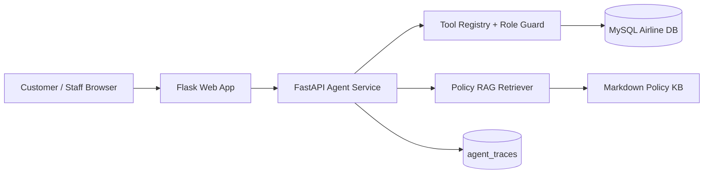

# Airline AgentOps Platform

Production-like AI Agent MVP built on top of a Flask/MySQL airline ticket reservation system.

This project demonstrates a stable **P0/P1 Agent demo** for AI application engineering: ReAct-style tool routing, safe tool calling, RAG policy QA with citations, pending booking confirmation, role-based staff analytics, user memory, deterministic Agent Eval, SFT-ready trace export, Docker Compose, and acceptance tests.

P1 is complete for the current portfolio scope. The customer agent can save route, budget, and airline preferences, then apply them to later searches when the user omits those details. The eval suite uses deterministic task checks for expected tools, answer keywords, citations, forbidden tools, and selected tool arguments. Trace export produces SFT-ready JSONL trajectories without claiming that real SFT has been performed.

P0.5 adds a Figma-inspired visual refresh for portfolio presentation: travel hero, refined navigation, dashboard cards, readable tables, and polished Agent/Copilot chat panels. It is presentation-only and does not change Agent behavior.

It intentionally uses synthetic/demo airline inventory and mock payment. It does **not** connect to real airline inventory, real ticketing systems, or real payment processors.

## Architecture



## P0 Demo Flows

Customer Booking Agent at `/customer/agent`:

- Search flights with natural language: `Find flights from SFO to LAX next month`
- Ask RAG policy questions: `Can I get a refund if my flight is cancelled?`
- Create a pending mock booking: `Book United flight P0206 at 2026-06-08 09:30:00`
- Confirm the pending booking before a mock ticket is written
- Display answer, tool calls, citations, and confirmation button
- P1 Memory prompt: `Remember I prefer United and usually fly SFO to LAX under 500`
- Later memory-backed search: `Find flights next month`

Staff Operations Copilot at `/staff/copilot`:

- Ask analytics questions: `Which flights have the worst reviews?`
- Call staff-only analytics tools
- Display answer, tool calls, and table data

## P0 Tool Boundary

Customer tools:

- `search_flights`
- `get_customer_trips`
- `create_booking_intent`
- `confirm_booking`
- `answer_policy_question`

Staff tools:

- `get_sales_report`
- `analyze_reviews`
- `get_flight_load_factor`
- `get_route_performance`
- `answer_policy_question`

The agent cannot execute raw SQL. Database-backed actions must go through registered tools. Customer sessions cannot call staff-only tools.

## Run Locally

Install dependencies:

```bash
cd "/Users/keith1117/Documents/CS-3083 Database/project/part3"
source .venv/bin/activate
pip install -r requirements.txt
```

Seed the minimal P0 demo data:

```bash
python -m scripts.seed_p0_demo
```

Start the FastAPI Agent service:

```bash
uvicorn agent_service.main:app --host 127.0.0.1 --port 8001
```

Start the Flask web app:

```bash
FLASK_DEBUG=0 FLASK_PORT=5050 python app.py
```

Open:

- Flask web app: `http://127.0.0.1:5050`
- Agent health: `http://127.0.0.1:8001/health`

Demo accounts:

- Customer: `testcustomer@nyu.edu` / `1234`
- Staff: `admin` / `abcd`

## Test Commands

Fast tests without MySQL acceptance:

```bash
python -m pytest tests -q
```

P0 acceptance tests with local MySQL:

```bash
RUN_P0_ACCEPTANCE=1 python -m pytest tests -q
```

P1 Memory acceptance tests:

```bash
RUN_P1_MEMORY=1 python -m pytest tests/test_p1_memory.py -q
```

P1 Basic Eval acceptance:

```bash
RUN_P1_EVAL=1 python -m pytest tests/test_p1_eval.py -q
```

Run the eval suite through the Agent API after starting FastAPI:

```bash
curl -X POST http://127.0.0.1:8001/api/eval/run \
  -H 'Content-Type: application/json' \
  -d '{"suite_name":"default"}'
```

Current P1 Basic Eval result:

```text
total: 20
passed: 20
task_success_rate: 1.0
tool_call_accuracy: 1.0
citation_presence_rate: 1.0
average_steps: 1.1
failed_cases: []
```

P1 Trace Export acceptance:

```bash
RUN_P1_TRACE=1 python -m pytest tests/test_p1_trace_export.py -q
```

Export SFT-ready trajectory JSONL:

```bash
python -m agent_service.export_traces
```

The export writes JSONL records with `user -> assistant reasoning -> tool -> assistant final` messages plus metadata such as session id, role, principal, and tool names.

P1 Core regression tests:

```bash
RUN_P1_CORE=1 python -m pytest tests/test_p1_core_regressions.py -q
```

These cover RAG no-context fallback and safe booking idempotency behavior.

Complete P0/P1 acceptance suite:

```bash
RUN_P0_ACCEPTANCE=1 RUN_P1_MEMORY=1 RUN_P1_EVAL=1 RUN_P1_TRACE=1 RUN_P1_CORE=1 \
  python -m pytest tests -q
```

Current verified result:

```text
22 passed
```

P0.5 UI smoke result:

```text
4 passed
```

P1 Docker config tests:

```bash
python -m pytest tests/test_p1_docker_config.py -q
```

Docker Compose one-command stack:

```bash
docker compose up --build
```

Then open:

- Flask web app: `http://127.0.0.1:5050`
- Agent health: `http://127.0.0.1:8001/health`

The Compose stack includes MySQL, the FastAPI Agent service, the Flask web app, and a one-shot `seed` service that runs `python -m scripts.seed_p0_demo` so the P0 demo flight is available.

Docker Compose runtime has been verified locally with MySQL, the seed service, the FastAPI Agent service, and the Flask web app all running successfully.

Current Docker config test result:

```text
2 passed
```

P0 acceptance covers:

- Customer flight search calls `search_flights`
- RAG policy answer returns citations
- Booking requires `PENDING_CONFIRMATION`
- Confirmation writes a mock ticket
- Staff copilot calls staff analytics tools
- Customer cannot call staff-only tools
- Staff chat does not execute customer booking tools

## Boundaries

- Demo inventory is synthetic and seeded locally.
- Payment is mocked with a non-real payment token.
- This is a production-like MVP, not a real airline commerce platform.
- P2 items such as large-scale data generation, load testing, observability dashboards, SFT, and Agentic RL are intentionally out of scope for the current stable demo.

## Resume Line

Built a production-like airline AgentOps MVP with Flask, FastAPI, MySQL, ReAct-style tool calling, RAG policy QA with citations, role-based tool guards, user memory, deterministic Agent Eval, SFT-ready trace export, Docker Compose, pending booking confirmation, mock payment, Figma-inspired UI refresh, and 22 passing P0/P1/P0.5 acceptance tests.
