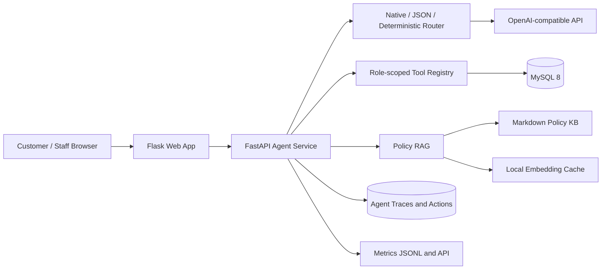

# Airline AgentOps Platform

[English](README.md) | [简体中文](README.zh-CN.md)

一个近似生产环境的航空运营平台，整合了 Flask 订票应用、FastAPI Agent 服务、MySQL、基于政策的 Grounded RAG、受限多步执行、人工确认和 AgentOps 可观测性。

**项目状态：** P0–P4 已全部完成并通过验证。本仓库使用合成航班库存和模拟支付，面向 Agent 工程、治理和全栈功能演示，不用于真实航空交易。

## 项目概览

平台提供两种经过身份验证的使用体验：

- 客户可以使用 IATA 代码或中英文城市名称搜索航班，询问带引用的政策问题，保存旅行偏好，查看行程，准备购票，并确认取消预览。
- 航司员工可以使用有角色权限限制的 Copilot 分析销售、评价、客座率和航线表现，并在 AgentOps 仪表盘中检查 trace、fallback、延迟和确认事件。

模型负责选择或编排获准的工具；本地服务负责身份、授权、校验、数据库访问和事务边界。模型不能直接访问 SQL，也不能通过普通对话完成购票或取消。

## 核心能力

| 领域 | 已实现行为 |
| --- | --- |
| 自然语言查询 | 将 IATA 代码、中英文城市名称、相对日期、月份、年份、航司偏好和预算解析为数据库库存查询。 |
| Customer Agent | 搜索可购买航班、回答带引用的政策问题、查询有效行程，并记忆航线、航司和预算偏好。 |
| 购票跳转 | 购买请求在选定航班后停止，并打开 Search Flights checkout；对话不会直接签发机票。 |
| 取消流程 | Agent 计算费用和退款预览，并在执行取消前创建需要确认的操作。 |
| Staff Copilot | 执行航司范围内的销售、评价、客座率和关联航线表现分析。 |
| 受限运行时 | 支持 `single_step`、`bounded_react` 和 `auto`，包含步数限制、角色工具、observation 和明确的 stop reason。 |
| Grounded RAG | 配置后使用 embedding 检索和 grounded LLM 回答；外部服务不可用时回退到关键词检索和抽取式回答。 |
| Human-in-the-loop | 持久化购票和取消操作、过期时间、决策、幂等结果及审计事件。 |
| AgentOps | 提供请求指标和员工仪表盘，展示 trace、工具、运行模式、延迟、fallback、错误和确认关卡。 |
| 治理 | 使用签名服务身份、CSRF 防护、角色与航司隔离、工具风险分类、UTC 存储和 IANA 时区显示。 |

## 架构



Flask 应用负责浏览器 session 和面向用户的业务流程，并通过短时有效的签名服务身份调用 FastAPI。FastAPI 规划受限任务、校验工具权限、执行本地业务操作并记录运行元数据。

## 技术栈

| 层级 | 技术 |
| --- | --- |
| Web 应用 | Python 3.11、Flask、Jinja、HTML/CSS/JavaScript |
| Agent 服务 | FastAPI、Pydantic、Uvicorn |
| 数据访问 | MySQL 8、PyMySQL、参数化 SQL |
| AI 与检索 | OpenAI-compatible chat/tool API、embedding 检索、Markdown 政策知识库 |
| 安全 | ItsDangerous 签名身份、session-bound CSRF、角色/工具保护 |
| 测试与负载 | pytest、Locust、浏览器响应式 smoke tests |
| 运行环境 | Docker Compose |

## 快速开始

### 环境要求

- Git
- Docker Desktop 或带 Compose v2 的 Docker Engine
- 可选：用于 native routing、embedding 和 grounded LLM 回答的 OpenAI-compatible API key

### 1. 克隆并配置

```bash
git clone https://github.com/keith1117/airline-agentops-platform.git
cd airline-agentops-platform
cp .env.example .env
```

默认配置无需外部模型即可运行。在 `auto` 模式下，不可用的模型能力会回退到 deterministic routing、关键词检索和抽取式政策回答。

如需启用真实模型路径，在 `.env` 中设置：

```env
LLM_API_KEY=your_api_key
LLM_BASE_URL=https://api.openai.com/v1
LLM_MODEL=gpt-4o-mini

EMBEDDING_API_KEY=your_api_key
EMBEDDING_BASE_URL=https://api.openai.com/v1
EMBEDDING_MODEL=text-embedding-3-small
```

### 2. 启动服务

```bash
docker compose up --build
```

Compose 会启动 MySQL、导入演示库存，并启动 Agent 服务、Flask Web 应用和 phpMyAdmin。所有对外端口仅绑定到 loopback。

### 3. 打开服务

| 服务 | URL |
| --- | --- |
| Web 应用 | <http://127.0.0.1:5050> |
| Agent 健康检查 | <http://127.0.0.1:8001/health> |
| phpMyAdmin | <http://127.0.0.1:8080> |

演示账号：

| 角色 | 用户名 | 密码 |
| --- | --- | --- |
| 客户 | `testcustomer@nyu.edu` | `1234` |
| 航司员工 | `admin` | `abcd` |
| phpMyAdmin | `root` | `root` |

检查服务状态与健康情况：

```bash
docker compose ps
curl http://127.0.0.1:8001/health
```

停止服务并保留数据库 volume：

```bash
docker compose down
```

## 配置

以 `.env.example` 作为可用配置项的权威来源。

| 分组 | 变量 | 默认行为 |
| --- | --- | --- |
| 数据库 | `MYSQL_HOST`、`MYSQL_PORT`、`MYSQL_USER`、`MYSQL_PASSWORD`、`MYSQL_DB` | Docker 使用内部 MySQL 服务；宿主机端口为 `3307`。 |
| Agent 路由 | `AGENT_ROUTER_MODE`、`TOOL_ROUTER_MODE` | `auto` 依次尝试 native tool calling、JSON routing 和 deterministic routing。 |
| 运行时 | `AGENT_RUNTIME_MODE`、`MAX_AGENT_STEPS` | 默认为 `single_step`；启用 bounded execution 时最大 4 步。 |
| 检索 | `RAG_RETRIEVER_MODE`、`RAG_TOP_K`、`RAG_SIMILARITY_THRESHOLD` | `auto`、前 3 个政策 chunk、最低相似度 `0.35`。 |
| 政策回答 | `POLICY_ANSWER_MODE` | `auto` 在可用时使用 grounded LLM，否则使用抽取式回答。 |
| 模型 | `LLM_API_KEY`、`LLM_BASE_URL`、`LLM_MODEL` | OpenAI-compatible endpoint；fallback 运行不要求 API key。 |
| Embedding | `EMBEDDING_API_KEY`、`EMBEDDING_BASE_URL`、`EMBEDDING_MODEL`、`EMBEDDING_DIMENSIONS` | embedding 专用配置为空时继承 LLM 连接。 |
| 知识库 | `RAG_POLICY_PATH`、`RAG_EMBEDDING_CACHE` | Markdown 政策源和本地 JSON embedding cache。 |
| 可观测性 | `AGENT_TRACE_ENABLED`、`METRICS_LOG_PATH` | 默认启用 trace；metrics 写入 `logs/`。 |
| 时间 | `TZ`、`BUSINESS_TIMEZONE` | 服务使用 UTC；业务报表默认使用 UTC。 |
| 服务安全 | `SECRET_KEY` | 空值或开发值会创建由 Docker 服务共享的持久化本地随机 secret。 |

支持的模式值：

```text
AGENT_ROUTER_MODE=auto | deterministic | llm
TOOL_ROUTER_MODE=auto | native | json | deterministic
AGENT_RUNTIME_MODE=auto | single_step | bounded_react
RAG_RETRIEVER_MODE=auto | keyword | embedding
POLICY_ANSWER_MODE=auto | extractive | llm
```

## 演示流程

### 客户购票

1. 使用演示客户账号登录并打开 **AI Agent**。
2. 输入：`Find the cheapest flight from San Francisco to Los Angeles next month and prepare a booking.`
3. 检查来自数据库的结果并选择 **Book**。
4. 在 **Search Flights** 确认具体航班，填写 checkout 字段并提交模拟购买。
5. 在 **My Flights** 查看签发的机票，并在 **Pending Actions** 查看已完成操作。

Checkout 接受 13–19 位卡号进行格式校验。系统不会持久化该号码；机票仅保存固定的 `MOCK-PAYMENT` token。

### 政策问答

输入：`Can I get a refund if my flight is cancelled?` 后端会从检索到的政策 chunk 中选择 citation 并随回答返回。

### 取消确认

1. 向 Customer Agent 提出取消指定 ticket ID 的请求。
2. 查看计算出的费用和退款预览。
3. 打开 **Pending Actions**，明确确认或拒绝该操作。

预览不会修改机票状态。确认操作会重新校验原始预览，并以原子事务提交取消结果和审计事件。

### 员工运营

1. 使用演示员工账号登录并打开 **AI Copilot**。
2. 输入：`Which route has strong sales but poor reviews?`
3. 查看关联的航线与评价 observation。
4. 打开 **AgentOps**，检查运行模式、工具顺序、延迟、fallback 状态和 bounded trajectory。
5. 使用 **Action Queue** 审计本航司的客户操作；员工不能代替客户确认交易。

## API 与安全边界

| Endpoint | 权限 | 用途 |
| --- | --- | --- |
| `GET /health` | 公共本地健康检查 | 返回 Agent、数据库、政策索引和时钟状态。 |
| `POST /api/agent/customer/chat` | 签名客户身份 | 执行限定于已登录客户的 Customer Agent 请求。 |
| `POST /api/agent/staff/chat` | 签名员工身份 | 执行限定于已登录航司的 Staff Copilot 请求。 |
| `POST /api/agent/confirm-cancellation` | 签名客户身份 | 执行有效的持久化取消操作。 |
| `GET /api/agentops/dashboard` | 签名员工或 operator 身份 | 返回航司范围内的 trace 和 AgentOps 聚合结果。 |
| `GET /api/metrics` | 签名员工或 operator 身份 | 返回内存中的请求、延迟、错误、角色和工具指标。 |
| `POST /api/eval/run` | 签名 operator 身份 | 运行 evaluation suite。 |
| `POST /api/agent/confirm-booking` | 已停用（`410 Gone`） | 禁止直接调用 API 购票；必须使用 checkout。 |

安全和事务规则：

- 浏览器 POST 请求使用 session-bound CSRF token，以及 HTTP-only、SameSite cookie。
- FastAPI `/api/*` 路由要求使用 120 秒后过期的签名身份。
- Principal 和航司范围独立于模型输出进行校验。
- 工具分为 `safe_read`、`controlled_write` 和 `human_confirmed`。
- 模型不能执行原始 SQL，也不能通过普通路由调用 `human_confirmed` 工具。
- 购票使用行锁、最后座位保护、价格校验、单调递增 ticket allocation 和幂等操作结果。
- Staff trace 视图会隐藏客户请求和回答正文，同时保留运行元数据。
- MySQL session、服务时钟、trace 和审计时间戳使用 UTC；页面显示机场当地和旅客当地 IANA 时区。

## 测试与验证结果

在 Docker 外运行测试时，先创建本地环境：

```bash
python3.11 -m venv .venv
source .venv/bin/activate
pip install -r requirements.txt
```

不包含 MySQL acceptance tests 的快速 deterministic 回归：

```bash
TOOL_ROUTER_MODE=deterministic \
AGENT_ROUTER_MODE=deterministic \
RAG_RETRIEVER_MODE=keyword \
POLICY_ANSWER_MODE=extractive \
python -m pytest tests -q
```

使用运行中的 Docker MySQL 服务执行完整回归：

```bash
MYSQL_HOST=127.0.0.1 MYSQL_PORT=3307 \
RUN_P0_ACCEPTANCE=1 RUN_P1_MEMORY=1 RUN_P1_EVAL=1 \
RUN_P1_TRACE=1 RUN_P1_CORE=1 RUN_P4_ACTIONS=1 \
python -m pytest tests -q
```

单独运行 bounded runtime 测试：

```bash
python -m pytest tests/test_p3_bounded_react.py -q
```

Deterministic Agent QA：

```bash
python -m agent_service.run_agent_qa \
  --seed 42 \
  --count 24 \
  --tool-router-mode deterministic \
  --runtime-mode bounded_react \
  --rag-retriever-mode keyword \
  --policy-answer-mode extractive \
  --fail-on-failures
```

从 Agent 容器中执行已认证的 20 用户 Locust smoke：

```bash
docker compose exec -T agent python -m locust \
  -f load_tests/locustfile.py \
  --headless \
  --host http://127.0.0.1:8001 \
  --users 20 \
  --spawn-rate 5 \
  --run-time 1m \
  --only-summary
```

最新验证结果：

| 领域 | 结果 |
| --- | --- |
| Deterministic 回归 | `110 passed, 24 skipped` |
| Docker MySQL 完整回归 | `134 passed` |
| P3 bounded runtime | `23 passed` |
| Basic Agent eval | `23/23 passed`；tool accuracy 和 citation presence 均为 `1.0` |
| Deterministic QA smoke | `10 passed, 0 failed` |
| 真实模型 smoke | Native `search_flights` 通过；返回的 2 条航班与数据库记录一致；embedding 检索、grounded LLM 回答和政策 citation 均通过。 |
| 外部 API 故障 | Deterministic router、关键词检索、抽取式回答、fallback reason 和 citation 均通过。 |
| 响应式 UI | Pending Actions、checkout 和 AgentOps 在 `1440x900` 与 `390x844` 下通过，无页面级横向溢出。 |

Locust 结果：

| 场景 | 请求数 | 失败数 | 平均延迟 | P95 |
| --- | ---: | ---: | ---: | ---: |
| 客户航班查询 | 563 | 0 | 26 ms | 45 ms |
| 客户政策问答 | 563 | 0 | 12 ms | 19 ms |
| 员工评价分析 | 563 | 0 | 21 ms | 33 ms |
| 员工销售报表 | 562 | 0 | 18 ms | 28 ms |
| Metrics polling | 562 | 0 | 1 ms | 2 ms |
| **总计** | **2813** | **0** | **16 ms** | **33 ms** |

观测吞吐量为 `47.17 requests/s`。这是用于回归和演示的本地 smoke benchmark，不代表生产容量或服务等级目标。

## 仓库结构

```text
.
├── agent_service/       FastAPI Agent runtime、tools、RAG、actions、security 和 metrics
├── templates/           Customer 和 staff Flask views
├── static/              共享样式和浏览器时区处理
├── tests/               Unit、regression、acceptance、security 和 timezone tests
├── eval/                Deterministic Agent evaluation suites
├── load_tests/          Locust workload
├── scripts/             Seed、synthetic-data、QA 和 load helpers
├── sql/                 核心 schema、Agent migration 和演示数据
├── docs/                政策与实现记录
├── app.py               Flask 应用
└── docker-compose.yml   本地多服务 stack
```

项目文档：

- [P0–P4 完整开发日志](docs/development-log-p0-p4.md)
- [航空政策知识库](docs/policies/airline_policy.md)
- [P0 项目进度记录](docs/project_progress_report_p0.md)
- [P3/P4 bounded AgentOps 实施记录](docs/P3-P4.md)

## 限制

- 航班库存、客户、机票和评价均为合成数据或本地 seed 数据。
- 支付为模拟流程；系统不保存卡号，也不会连接支付处理商。
- 项目不连接航司分销、预订或票务系统。
- Embedding 索引使用轻量本地 JSON cache，而非托管 vector database。
- 仓库包含 evaluation 和 SFT-ready trace export，但没有执行模型微调、SFT 训练或 Agentic RL 训练。
- 当前 Docker 配置是本地演示 stack，不是生产部署规范。
