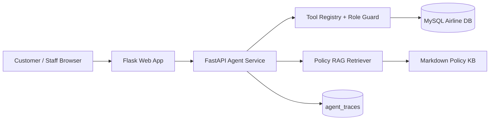

# Project Progress Report: From Airline Reservation System to P0 AgentOps MVP

## 1. Original Project Baseline

The original project was a Flask + MySQL airline ticket reservation system built around traditional database-backed web workflows.

Core features included:

- Customer registration and login
- Staff registration and login
- Public and customer flight search
- Customer ticket purchase
- Customer trip and review management
- Staff flight creation and status management
- Staff airplane management
- Staff customer lookup, ratings, and sales reports

The project already had a useful business domain: customers, staff, airlines, airports, airplanes, flights, tickets, and reviews. This made it a good foundation for an AI Agent application because the system already had real business actions that could be exposed as controlled tools.

However, before P0, the project did not include:

- LLM or Agent functionality
- Tool calling
- RAG / knowledge base
- Agent memory
- Agent traces
- Agent evaluation
- Role-based Agent tool boundaries
- Production-like mock booking confirmation
- Dedicated AI demo pages

## 2. P0 Goal

The goal of P0 was not to build a full enterprise product. The goal was to create a stable, demonstrable, resume-ready **production-like AI Agent MVP** on top of the existing reservation system.

P0 success criteria:

- Keep the original Flask application working.
- Add a separate FastAPI Agent service.
- Let customers and staff interact with AI pages from the web UI.
- Implement controlled tool calling instead of letting the Agent directly access SQL.
- Support RAG policy QA with citations.
- Support a safe mock booking flow with pending confirmation.
- Support staff analytics through staff-only tools.
- Add trace logging for Agent actions.
- Pass P0 acceptance tests against local MySQL.

## 3. P0 Architecture Added

P0 introduced a dual-service architecture:



Key design choices:

- Flask remains the main web app.
- FastAPI handles Agent API requests.
- MySQL remains the source of truth for flights, tickets, customers, staff, and reviews.
- The Agent service uses a registered tool layer.
- Customer and staff roles have different allowed tools.
- RAG uses a lightweight local policy retriever for stable P0 demo behavior.

## 4. P0 Features Implemented

### Customer Booking Agent

New page:

- `/customer/agent`

Implemented capabilities:

- Natural-language flight search
- Customer trip lookup
- Airline policy question answering through RAG
- Pending booking intent creation
- Explicit mock booking confirmation
- Display of answer, tool calls, citations, and confirmation button

Example demo prompts:

```text
Find flights from SFO to LAX next month
Can I get a refund if my flight is cancelled?
Book United flight P0206 at 2026-06-08 09:30:00
```

### Staff Operations Copilot

New page:

- `/staff/copilot`

Implemented capabilities:

- Review analysis
- Sales report lookup
- Flight load factor lookup
- Route performance lookup
- Staff-only tool access

Example demo prompts:

```text
Which flights have the worst reviews?
Show me the sales report for the last year
Which flights are close to full?
What are the most popular routes?
```

### RAG Policy Knowledge Base

Added a Markdown policy knowledge base covering:

- Baggage policy
- Refund policy
- Delay policy
- Booking confirmation policy
- Mock payment policy
- Agent safety policy

The Agent can answer policy questions and return citations, such as `Refund Policy` from the policy document.

### Safe Mock Booking Flow

The Agent cannot directly issue a ticket from a natural-language request.

The flow is:

1. Customer asks to book a flight.
2. Agent creates a `PENDING_CONFIRMATION` booking intent.
3. UI shows a `Confirm Mock Booking` button.
4. Customer clicks the button.
5. The Agent service validates the flight again.
6. A mock ticket is written to `Ticket`.

This keeps irreversible actions behind explicit user confirmation.

### Agent Tool Boundary

Customer tools:

- `search_flights`
- `get_customer_trips`
- `create_booking_intent`
- `confirm_booking`
- `answer_policy_question`

Staff tools:

- `get_sales_report`
- `analyze_reviews`
- `get_flight_load_factor`
- `get_route_performance`
- `answer_policy_question`

The Agent does not execute raw SQL directly. All database actions go through registered tools.

### Agent Trace Tables

Added minimal Agent tables:

- `agent_sessions`
- `agent_traces`
- `booking_intents`
- `user_preferences`

P0 mainly uses sessions, traces, and booking intents. `user_preferences` is reserved for P1 Memory.

## 5. P0 Validation

P0 acceptance tests were added and run against local MySQL.

Command:

```bash
RUN_P0_ACCEPTANCE=1 python -m pytest tests -q
```

Verified result:

```text
8 passed
```

Acceptance coverage:

- Customer can search future flights with natural language.
- Agent calls `search_flights`.
- RAG policy answer returns citations.
- Customer can create a pending booking intent.
- Customer confirmation writes a mock ticket.
- Staff Copilot calls staff analytics tools.
- Customer cannot call staff-only tools.
- Staff chat does not execute customer booking tools.

Browser verification was also completed:

- `/customer/agent` successfully calls FastAPI and displays answer, tool calls, RAG citations, and confirmation button.
- `/staff/copilot` successfully calls FastAPI and displays answer, tool calls, and table data.

## 6. Important Fixes During P0

### Local Agent Service Proxy Issue

The Flask app initially received `503` when calling the Agent service because local requests were affected by environment proxy settings.

Fix:

- Flask now uses a `requests.Session()` with `trust_env = False` for Agent service calls.

### Expired Demo Data

The original seed data included flights that were no longer future flights relative to the current date.

Fix:

- Added `scripts/seed_p0_demo.py`.
- It creates a minimal future P0 demo flight: `United P0206` from `SFO` to `LAX`.

### Flask Import Stability

The original Flask app opened a MySQL connection at import time.

Fix:

- Added a lazy MySQL connection wrapper so the app can import cleanly before the database is contacted by a route.

## 7. Current Boundaries

P0 is intentionally scoped.

Current boundaries:

- No real airline inventory integration.
- No real payment processor.
- No real ticketing/GDS/NDC integration.
- No large-scale synthetic data generation.
- No Locust pressure testing yet.
- No advanced Agent Eval dashboard.
- No real SFT or Agentic RL.
- UI is functional and demo-ready, but not fully polished.

This is a production-like MVP, not a real commercial airline platform.

## 8. Why P0 Is Resume-Relevant

P0 already demonstrates several skills relevant to AI Application Engineer / LLM Agent Developer roles:

- Agent application integration with an existing business system
- ReAct-style tool routing
- Tool calling with role-based boundaries
- RAG policy QA with citations
- Safe confirmation for irreversible actions
- Database-backed tools
- Trace logging
- Acceptance testing against real MySQL
- Clear mock/synthetic boundary

Resume positioning:

```text
Built a production-like airline AgentOps MVP with Flask, FastAPI, MySQL,
ReAct-style tool calling, RAG policy QA with citations, role-based tool guards,
pending booking confirmation, mock payment, trace logging, and P0 acceptance tests.
```

## 9. P1 Completion

P1 started only after P0 remained stable. UI feature development remained frozen unless there was a functional demo bug. The current P1 scope is now complete.

Current P1 status:

1. Agent Memory
   - Save customer preferences such as preferred airline, route, and budget.
   - Use memory in later searches when the user does not override preferences.
   - Status: completed and covered by P1 Memory acceptance tests.

2. Basic Agent Eval
   - Build a 20-30 task JSONL suite.
   - Measure task success rate, tool-call accuracy, citation presence, average steps, and failed cases.
   - Status: completed for the initial deterministic suite.
   - Current result: 20 total, 20 passed, task success rate 1.0, tool-call accuracy 1.0, citation presence rate 1.0, average steps 1.1, failed cases [].

3. Trace Export
   - Export ReAct/tool trajectories into SFT-ready JSONL.
   - Do not claim real SFT; position it as future optimization data.
   - Status: completed for initial JSONL export with metadata and tests.

4. Core Tests
   - Add tests for Memory, Eval, permissions, booking confirmation, and RAG fallback.
   - Status: completed for the current P1 scope.
   - Current additions cover RAG no-context fallback, booking idempotency, invalid idempotency rejection, Memory, Eval, Trace Export, P0 booking, and role boundaries.

Current complete P0/P1 acceptance result:

```text
22 passed
```

5. Docker
   - Keep Docker as an engineering polish item after Agent-specific P1 work.
   - Status: completed with Docker Compose runtime verification.
   - Verified stack: MySQL, one-shot seed service, FastAPI Agent service, and Flask web app.
   - Verified access: Flask web app on `http://127.0.0.1:5050` and Agent health on `http://127.0.0.1:8001/health`.

Final P0/P1 acceptance result:

```text
22 passed in 0.76s
```

## 10. P0.5 Presentation Cleanup

P0.5 updates the visual presentation of the Flask/Jinja website based on a flight-booking Figma reference. The scope is limited to UI styling, template layout, and screenshot readiness. Agent behavior, database schema, booking confirmation, eval, and Docker topology remain unchanged.

Completed cleanup:

- Added a Figma-inspired travel hero and floating flight search module to the landing page.
- Reworked shared navigation into a polished role-aware shell.
- Refreshed login and registration pages with auth cards over travel imagery.
- Updated customer search, trips, reviews, and AI Agent pages with cards, readable tables, citation pills, and confirmation panels.
- Updated staff dashboard, reports, create-flight, change-status, airplane, ratings, customers, and Copilot pages with dashboard styling.
- Added UI template smoke tests.

Current P0.5 smoke result:

```text
4 passed
```

## 11. P2 Observability Start

P2 has started with lightweight observability. This does not change Agent planning, tool behavior, booking confirmation, database schema, or the Flask UI. It adds request-level metrics around the FastAPI Agent service so later Locust and benchmark work can report measured latency and error behavior.

Completed P2 observability items:

- Added an in-memory metrics collector.
- Added JSONL runtime metrics logging at `logs/agent_metrics.jsonl`.
- Added `GET /api/metrics` for request, latency, role, tool-call, and error summaries.
- Added `METRICS_LOG_PATH` configuration.
- Kept runtime logs out of Git through `.gitignore` and `.dockerignore`.
- Added P2 metrics tests.

Current complete P0/P1/P0.5/P2 metrics test result:

```text
24 passed in 0.83s
```

## 12. P2 Locust Smoke Load Testing

P2 now includes a Locust smoke profile. The goal is controlled local validation, not large-scale benchmarking. The smoke test exercises the Agent service directly and is designed to pair with the `/api/metrics` endpoint added in the observability step.

Completed Locust items:

- Added `load_tests/locustfile.py`.
- Added `scripts/run_locust_smoke.sh`.
- Added Locust to `requirements.txt`.
- Covered customer flight search, customer policy QA, staff review analytics, staff sales reporting, and metrics polling.
- Added static Locust configuration tests.

Default smoke profile:

- 20 users
- spawn rate 5 users/sec
- 1 minute runtime
- CSV output under `logs/locust_smoke*`

This profile can be increased to 50-100 users after the default smoke completes cleanly.

Current local Locust smoke result:

```text
users: 2
runtime: 10s
requests: 55
failures: 0
aggregated avg latency: 14 ms
aggregated p95 latency: 38 ms
```

Agent metrics after smoke:

```text
total_requests: 58
error_count: 0
customer tool_calls: 24
staff tool_calls: 22
avg_latency_ms: 12.14
```

## 13. P2 Synthetic Data Generator

P2 now includes a deterministic synthetic data generator. The generator is designed for local benchmark and demo-data expansion, not real airline inventory. It writes SQL by default and only mutates MySQL when `--apply` is explicitly passed.

Completed synthetic data items:

- Added `scripts/generate_synthetic_data.py`.
- Generates synthetic airports, flights, customers, tickets, and reviews.
- Preserves referential integrity across Airline, Airport, Airplane, Flight, Customer, Ticket, and Review.
- Uses `SyntheticAir`, `SYN`-prefixed IDs, and `synthetic...@demo.local` customers to keep generated rows separate from P0 demo rows.
- Uses `INSERT IGNORE` to avoid overwriting existing demo rows.
- Ignores generated `sql/synthetic_data.sql` in Git and Docker build context.
- Added generator integrity tests.

Default generated scale:

- 24 airports
- 10,000 flights
- 2,000 customers
- 50,000 tickets
- 5,000 reviews

Current local generator smoke:

```text
Generated synthetic data: 5 airports, 12 flights, 8 customers, 20 tickets, 6 reviews -> /private/tmp/part3_synthetic_smoke.sql
```

Targeted synthetic data tests:

```text
2 passed
```

## 14. P2 Benchmark Table And README Update

P2 benchmark reporting is now consolidated in the README. The goal is to make the current project state easy to present in an interview or resume discussion without overstating production scale.

Completed benchmark/reporting items:

- Added a `Benchmark / Results` section to README.
- Summarized full regression test status.
- Summarized Agent health and metrics endpoints.
- Added Locust smoke benchmark table with request count, failures, average latency, and P95 latency.
- Added Agent metrics summary after Locust smoke.
- Added synthetic data generation benchmark table.
- Updated resume line from 26 tests to the current 28-test suite.

Current verification summary:

```text
28 passed in 1.33s
Agent health: 200 OK, database ok, policy_chunks 7
Metrics endpoint: 200 OK
Locust smoke: 55 requests, 0 failures, 14 ms aggregated avg latency, 38 ms P95
Synthetic generator smoke: SQL generated successfully
```

Boundary:

These benchmarks are local demo-stack measurements. They support portfolio evidence and regression tracking, but they are not production-scale performance claims.

## 15. P2 Advanced Eval / Agentic RL Design

The final P2 item is a design note, not an implementation of real model training. Real Agentic RL and SFT remain out of scope for the portfolio MVP. The project now documents how its existing eval, traces, metrics, and failed-case outputs could support future optimization.

Completed design items:

- Added advanced eval design to README.
- Added Agentic RL reward-signal design to README.
- Updated interview notes with accurate P2 status and talking points.
- Clarified that real SFT/RL training is not implemented.

Implemented foundations:

- Deterministic eval task suite.
- Trace export in SFT-ready JSONL format.
- Tool-call metadata.
- Citation presence checks.
- Role-boundary tests.
- Latency/error metrics.
- Failed-case reporting.

Future advanced eval dimensions:

- Citation correctness.
- Tool argument accuracy.
- Multi-step task success.
- Regression tracking by eval run.
- Failure clustering by root cause.

Future reward signals:

- Task completion.
- Correct tool selection.
- Tool argument correctness.
- Safety and permission compliance.
- Citation correctness.
- Efficiency and latency.
- Controlled failure when evidence is missing.

Boundary:

No real SFT or Agentic RL training is claimed. The project demonstrates the engineering scaffolding and design needed to support those future optimization methods.
